# Node.js Lessons Forum

## Installation
1. **Clone the Repository:**
   ```
   git clone https://github.com/MainMi/Node.js-Lessons-Forum
   ```

2. **Navigate to the Project Directory:**
   ```
   cd Node.js-Lessons-Forum/Labwork2
   ```
3. **Install Dependencies:**
   ```
   npm install
   ```
4. **Run:**
   ```
   node app.js
   ```

## Screenshots of the reworked students page

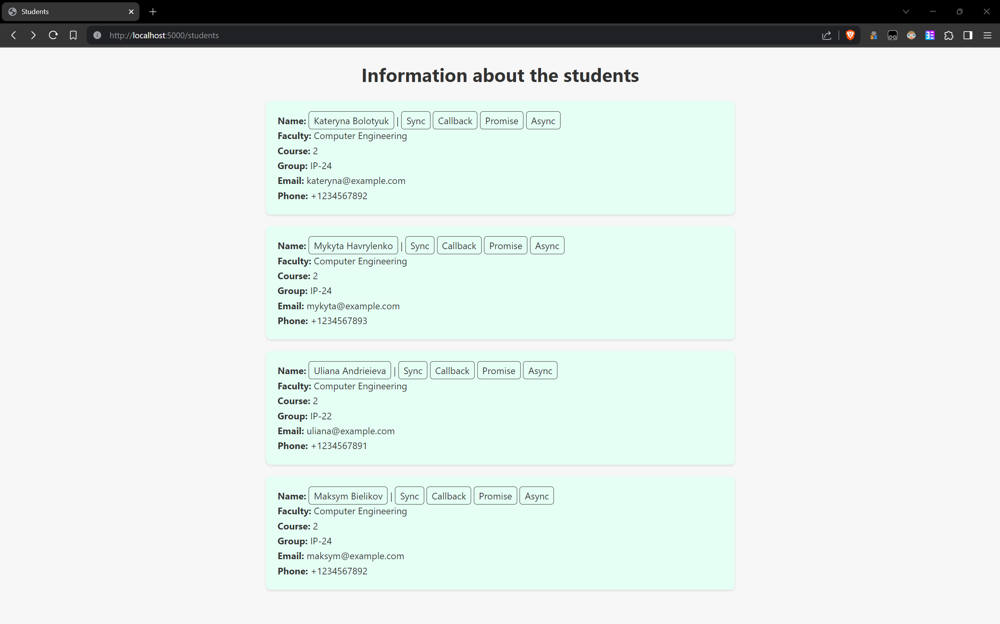
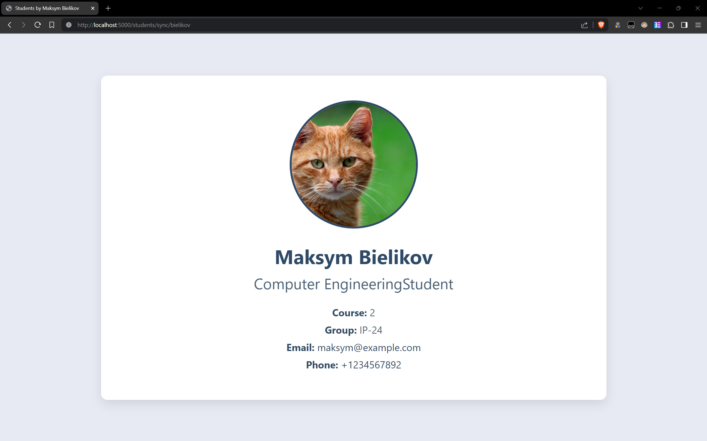
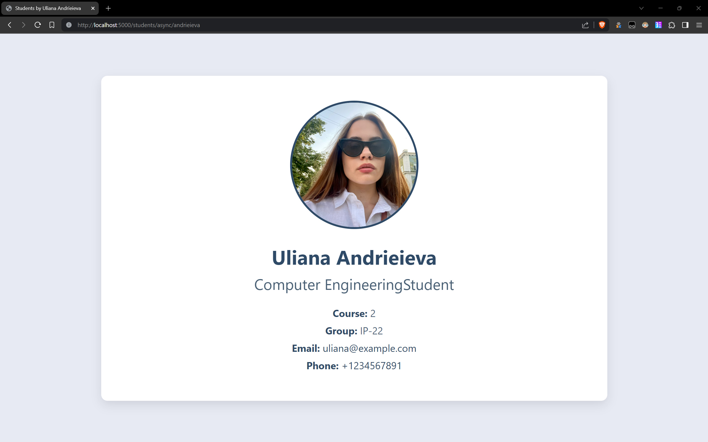

## Screenshots of out backend

1. User registration and auth

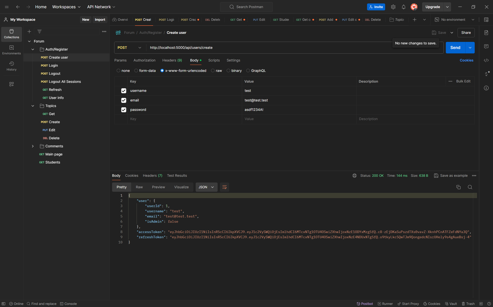
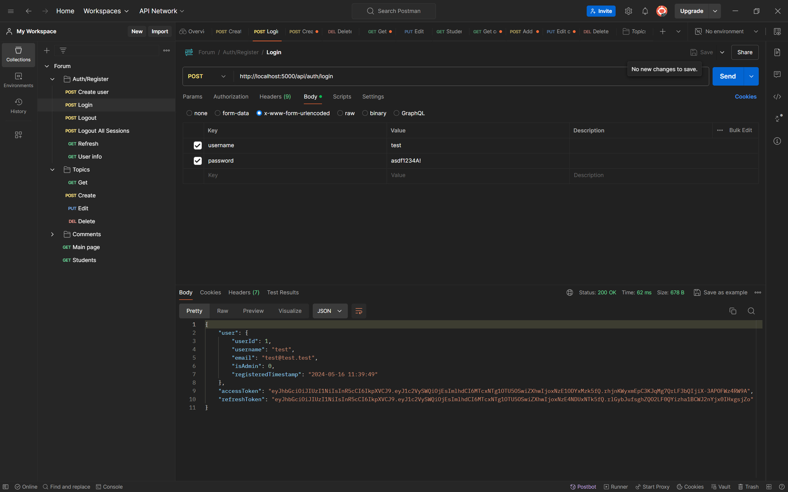
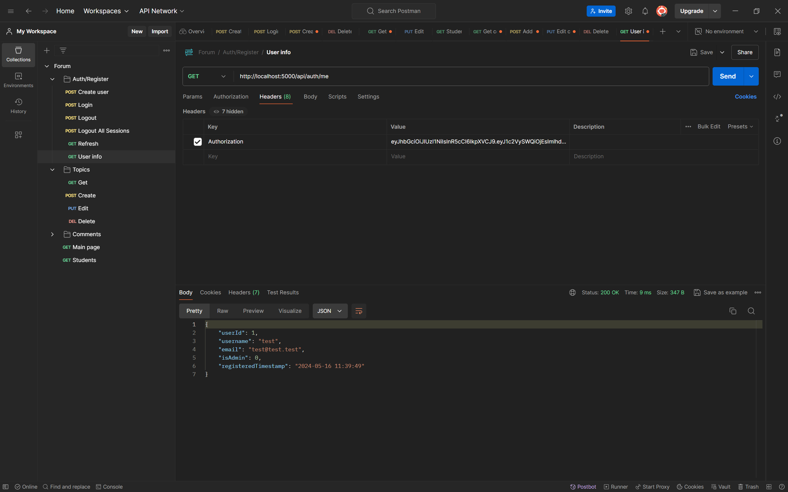

2. Forum topics CRUD operations

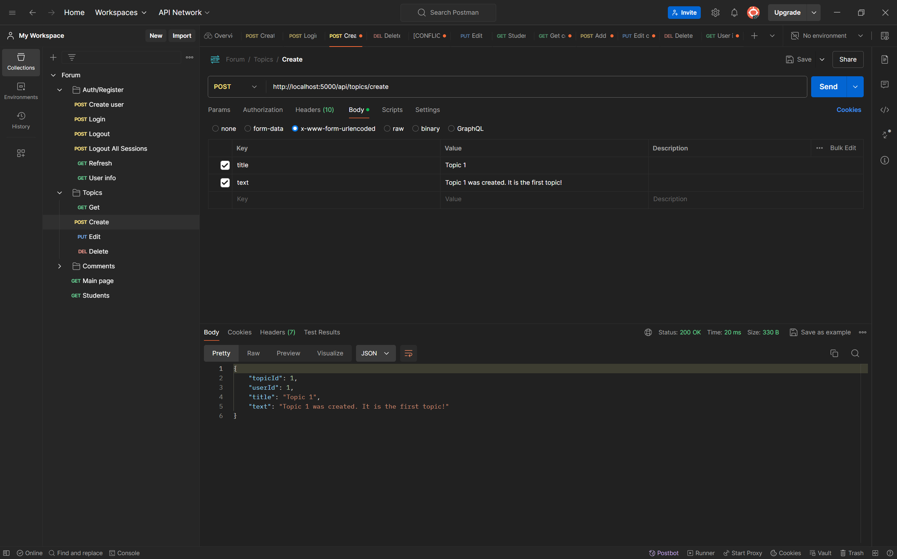
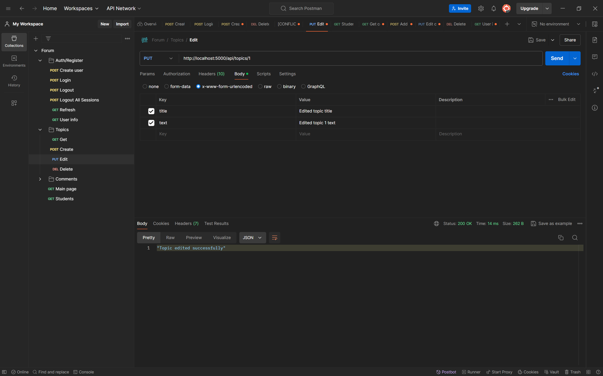
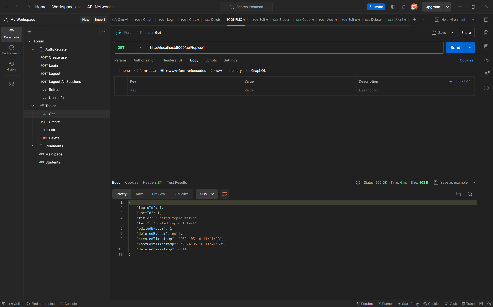
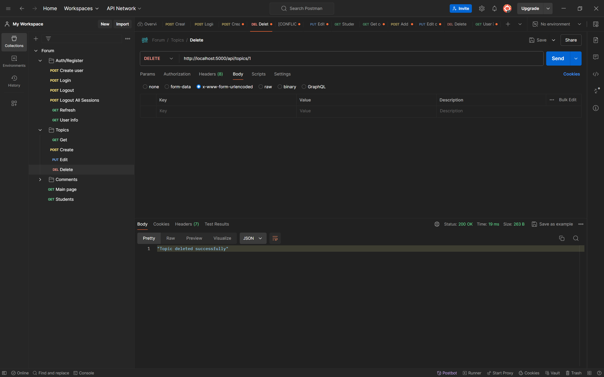
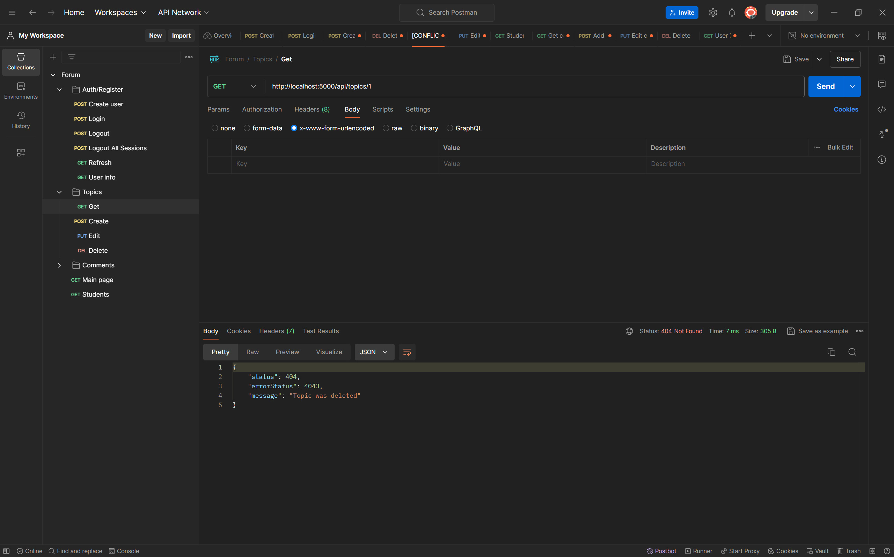

3. Forum comments CRUD operations

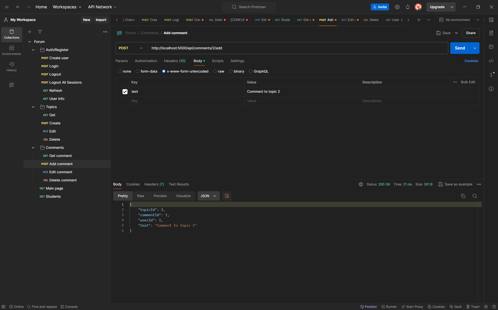
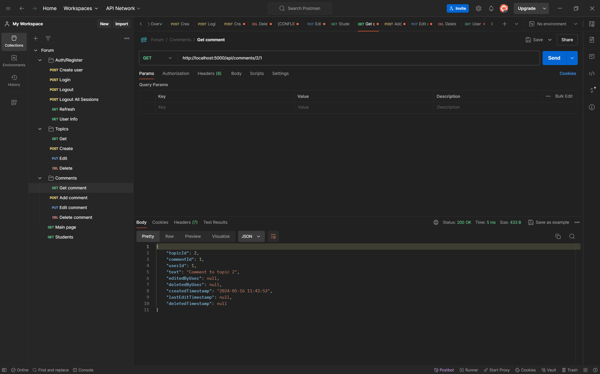
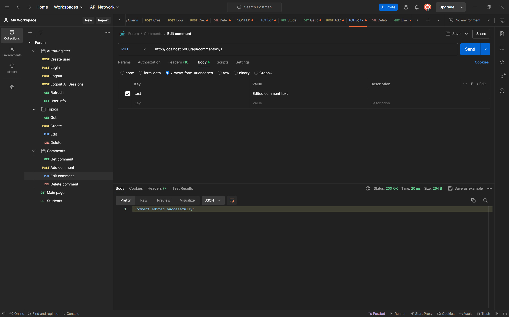

## Custom 404 page

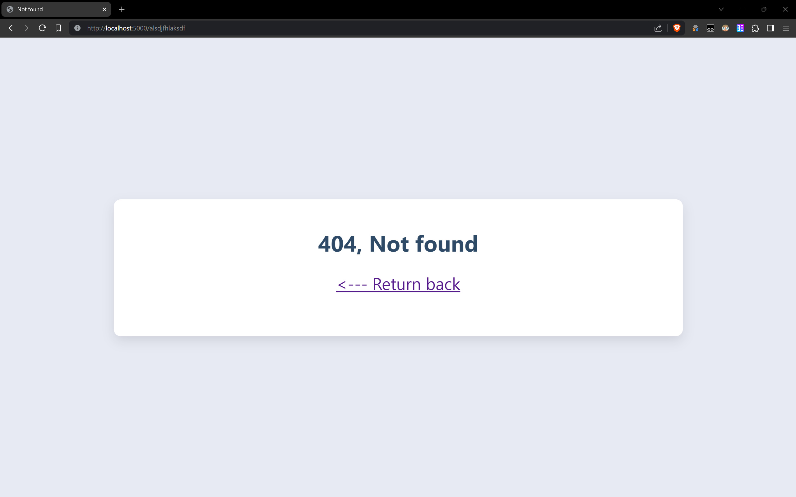
